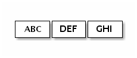
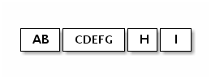

#处理基于流的运输
##Socket Buffer的一个小注意事项
在基于流的传输中，如TCP/IP，接收到的数据被存储在一个套接字接收缓冲区中。不幸的是，基于流的传输的缓冲区不是数据包的队列，而是字节的队列。这意味着，
即使你把两个消息作为两个独立的数据包发送，操作系统也不会把它们当作两个消息，而只是把它们当作一堆字节。因此，不能保证你所读到的就是你的远程同行所写的。
例如，我们假设操作系统的TCP/IP协议栈已经收到了三个数据包。

由于基于流的协议的这种普遍属性，在你的应用中，很有可能以下面的碎片形式读取它们。

因此，接收部分，不管是服务器端还是客户端，都应该将接收到的数据整理成一个或多个有意义的框架，以便于应用逻辑理解。
在上面的例子中，接收到的数据应该是如下的框架。

